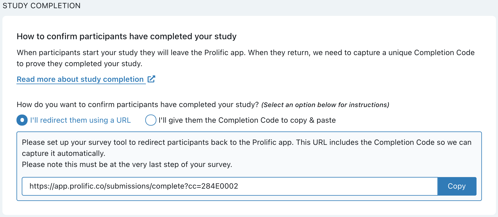
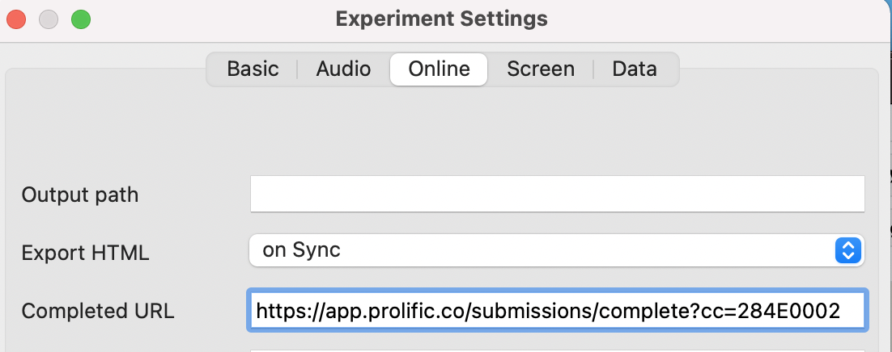

```{r include=FALSE}
library(leaflet)
library(knitr)
library(webshot)
```
class: center, middle

### hyperlinks are clickable in this tutorial
```{r setup, include=FALSE}
options(htmltools.dir.version = FALSE)
```


---
class: center, middle

# Tools you will need

###  [Qualtrics](https://emorycollege.co1.qualtrics.com/) 
### [PsychoPy3 desktop + Pavlovia](https://pavlovia.org)
### [Prolific](https://prolific.co)

---
class: left, middle

# Goals of testing adults online

- Automate things to reduce errors

- An elegant work flow that makes life easier for your participants

- **Chaining with Prolific, Qualtrics, and Pavlovia**


---
class: inverse, center, middle
# Basic Qualtrics


---
# Qualtrics

Obtain your **licenced** account from [Emory IT department](http://college.emory.edu/business-operations/information-technology/faqs.html):

--

You are recommended to use the [Qualtrics](https://emorycollege.co1.qualtrics.com/) to create consent and demographics forms <sup>1</sup>

- Create a new survey (consent form) from the menu `Create New Project -> Edit Question -> Question type -> Text/Graphic`<sup>2</sup>

--

- Click the `Question type` button to include a multiple choice question;

--
- Click the `Import from library` to import existing demographic questions

.footnote[
[1] You can use PsychoPy3 to create consent forms, but the UI is less ideal

[2] Per IRB guideline, include a departmental logo

]

---
# sample consent form

```{r echo=FALSE}
knitr::include_url("https://emorycollege.co1.qualtrics.com/jfe/form/SV_8G4CBJr4Fe43PaC")
```

---

---
class: inverse, center, middle

# Basic Pavlovia

Assuming you already have an activated study uploaded to Pavlovia

```{r echo=FALSE}
knitr::include_url("https://pavlovia.org/run/Yliu668/mrt_ganis_rep/html/")
```

---
# Passing in a participant ID to _Pavlovia_

You most likely have a main experiment for your participants. Participants'IDs should be carried to Pavolovia.

1. Use the Embed field in Qualtrics; `add a new field`

```yaml
prolific_ID = ${q://QID107/ChoiceTextEntryValue}
gender = ${q://QID127751975/ChoiceGroup/SelectedChoices}
```
--

2.Add "End of message" in Qualtrics. Each participant gets a unique link;
```yaml
https://run.pavlovia.org/Yliu668/mrt_rtb21/html?participant= ${q://QID107/ChoiceTextEntryValue}&gender=${q://QID127751975/ChoiceGroup/SelectedChoices}
```
Basically you want to match your field code in Qualtrics with the field in Pavlovia

---
# sample study with chaining


```yaml
https://run.pavlovia.org/Yliu668/mrt_rtb21/html?participant= yaxin&gender=female
```

```{r echo=FALSE}
knitr::include_url("https://run.pavlovia.org/Yliu668/mrt_rtb21/html?participant= yaxin&gender=female&group=tutorial")
```


---
# Passing an ID from _Prolific_ directly

You can see an introduction of this chaining from [this documentation](https://www.psychopy.org/online/prolificIntegration.html). 

- configure URL parameters
- 

```{r echo=FALSE,out.width="50%" }
knitr::include_graphics("https://www.psychopy.org/_images/prolificSettingsInsertParams.png")
```
---
# Completion url

- Copy the completion url from Prolific
- Make sure participants click this link at the **end** of your study

```{r echo=FALSE}

```

```
https://app.prolific.co/submissions/complete?cc=284E0002

```
---

# Examples

- if _Pavlovia_ is your final step, you can add it to the `Completed URL`

```{r, echo=FALSE, out.width="60%", fig.align = 'center'}

```

--
- You can also add to _Qualtrics_

```{r, echo=FALSE, out.width="40%", out.height= "10%", fig.show="hold", fig.aligh = 'center', tidy=TRUE}
knitr::include_graphics(c("qualtrics_complete.png", "prolific_page.png"))
```

---

# Tables

If you want to generate a table, make sure it is in the HTML format (instead of Markdown or other formats), e.g.,

```{r}
knitr::kable(head(iris), format = 'html')
```

---


```{r eval=require('DT'), tidy=FALSE}
DT::datatable(
  head(iris, 10),
  fillContainer = FALSE, options = list(pageLength = 8)
)
```

---
class: center, middle

# Thanks!

## Resources


