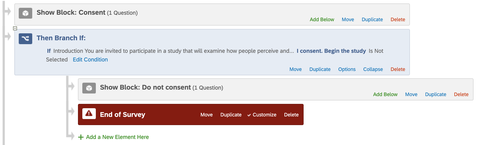
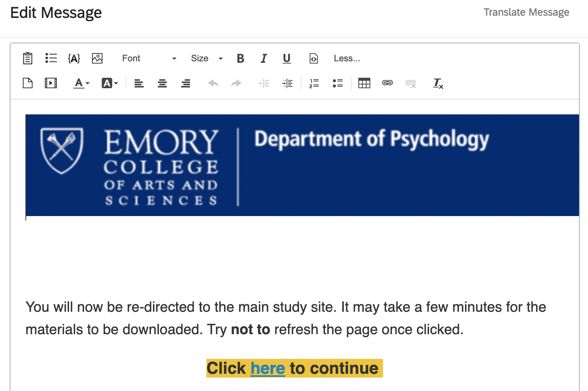

```{r include=FALSE}
library(leaflet)
library(knitr)
```


```{r xaringan-tile-view, echo=FALSE}
xaringanExtra::use_tile_view()
```
class: center, middle
```{r xaringanExtra-search, echo=FALSE}
xaringanExtra::use_search(show_icon = TRUE)
```


```{r xaringanExtra-clipboard, echo=FALSE}
xaringanExtra::use_clipboard()
```


```{r xaringan-editable, echo=FALSE}
xaringanExtra::use_editable(expires = 1)
```

### hyperlinks are clickable in this tutorial
You may also search the content

press letter `o` to toggle slides

```{r setup, include=FALSE}
options(htmltools.dir.version = FALSE)
```


---
class: center, middle

# Tools you will need

###  [Qualtrics](https://emorycollege.co1.qualtrics.com/) 
### [PsychoPy3 desktop + Pavlovia](https://pavlovia.org)
### [Prolific](https://prolific.co)

---
class: left, middle

# Goals of testing adults online

- Automate things to reduce errors

- An elegant work flow that makes life easier for your participants

- **Chaining with Prolific, Qualtrics, and Pavlovia**


---
class: inverse, center, middle
# Qualtrics basics


---
# Qualtrics 

Obtain your **licenced** account from [Emory IT department](http://college.emory.edu/business-operations/information-technology/faqs.html):

--

You are recommended to use the [Qualtrics](https://emorycollege.co1.qualtrics.com/) to create consent and demographics forms <sup>1</sup>

- Create a new survey (consent form) from the menu `Create New Project -> Edit Question -> Question type -> Text/Graphic`<sup>2</sup>

--

- Click the `Question type` button to include a multiple choice question;

--
- Click the `Import from library` to import existing demographic questions

.footnote[
[1] You can use PsychoPy3 to create consent forms, but the UI is less ideal

[2] Per IRB guideline, include a departmental logo

]

---
# Qualtrics branching

- You will have two branches. One for participants who complete the survey, the other for participants who click "Do not consent". 

```{r echo=FALSE,out.width="80%",fig.align='center' }

```

- Create a End of study message 
`Messages Library -> New Message`

```{r echo=FALSE,out.width="40%",fig.align='center' }

```

---
# sample consent form.can-edit[]

```{r echo=FALSE}
knitr::include_url("https://emorycollege.co1.qualtrics.com/jfe/form/SV_5oRtfSVUgYc8yvc")
```

---
class: inverse, center, middle

# Pavlovia Basics

Assuming you already have an activated study uploaded to Pavlovia

```{r echo=FALSE}
knitr::include_url("https://pavlovia.org/run/Yliu668/mrt_rtb21/html/")
```

---
# Passing in a participant ID to _Pavlovia_

You most likely have a main experiment for your participants. Participants'IDs should be send to Pavolovia.

1. Use the Embed field in Qualtrics; `add a new field`:  `prolific_ID` , `gender`, or more

```yaml
prolific_ID = ${q://QID107/ChoiceTextEntryValue}
gender = ${q://QID127751975/ChoiceGroup/SelectedChoices}
```
--

2.Add "End of message" in Qualtrics. Each participant gets a unique link;
```yaml
https://run.pavlovia.org/Yliu668/mrt_rtb21/html?participant= ${q://QID107/ChoiceTextEntryValue}&gender=${q://QID127751975/ChoiceGroup/SelectedChoices}
```
Basically you want to match your field code in Qualtrics with the field in Pavlovia

---
# sample study with chaining


```yaml
https://run.pavlovia.org/Yliu668/mrt_rtb21/html?participant= yaxin&gender=female
```

```{r echo=FALSE}
knitr::include_url("https://run.pavlovia.org/Yliu668/mrt_rtb21/html?participant= yaxin&gender=female&group=tutorial")
```


---
# Passing an ID from Prolific to Qualtrics

## Option 1 

- Add a question in your Qualtrics form
- Ask participants to copy and paste their Prolific IDs

```{r echo=FALSE,out.width="100%" }
knitr::include_graphics("https://s3.amazonaws.com/uploads.intercomcdn.com/i/o/14359998/c78630112107ef6e93f9a5ed/file-Ck7JjkGKP7.png")
```

---
# Passing an ID from Prolific to Qualtrics

### Option 2 (recommended)

#### Prolific
- Select     **`I'll use URL parameters`** and click `configure URL parameters`

```yaml
https://emorycollege.co1.qualtrics.com/jfe/form/SV_5oRtfSVUgYc8yvc?PROLIFIC_auto_ID={}
```
#### Qualtrics
- Add .can-edit[query strings] to your question (`right click ->Default Choices -> Embedded Data Field`)

```{r echo=FALSE,out.width="50%",fig.align='center'}

```
- Now your URL will be:

``` yaml 
https://emorycollege.co1.qualtrics.com/jfe/form/SV_5oRtfSVUgYc8yvc?PROLIFIC_auto_ID=5eb864599d66767bb037f277`
```

---
# Passing an ID from Prolific to Pavlovia

Since you will most likely to have a Qualtrics survey to begin with, we will skip the chaining with Prolific -> Pavlovia


Check out [this documentation](https://www.psychopy.org/online/prolificIntegration.html) 

<br>
<br>

Linking to Pavlovia directly, use a URL like this one:

```yaml
https://pavlovia.org/run/Yliu668/mrt_ganis_rep/html/?participant={}&study_id={}&Group={}
```

---
# How to confirm participants have completed your study

- Copy the completion url from Prolific
- Make sure participants click this link at the **end** of your study

```{r echo=FALSE}

```

``` yaml
https://app.prolific.co/submissions/complete?cc=284E0002
```
---

# Examples

- if _Pavlovia_ is your final step, you can add it to the `Completed URL`

```{r, echo=FALSE, out.width="60%", fig.align = 'center'}
knitr::include_graphics("psychopy_complete.png")
```

--
- You can also add to _Qualtrics_

```{r, echo=FALSE, out.width="40%", out.height= "10%", fig.show="hold", fig.aligh = 'center', tidy=TRUE}
knitr::include_graphics(c("qualtrics_complete.png", "prolific_page.png"))
```

---
# How do you send IDs from Pavlovia to Qualtircs?
If you have post-experiment questionnaires, chances are you need to re-direct your participants to Qualtrics again after their completion of the main experiment

<br>

In `Completed URL` dialog, 
you can save yourself time by using the sample code below:

```yaml
$"https://yourqualtricsURL?id="+expInfo['participant']
```

Just make sure you have the embedded data in your Qualtrics form. Here the **query string** is .can-edit[id].

---
# tips and tricks for _Prolific_  
- Add prescreening questions. For example:

  - Gender
  - Vision
  - Language

--
<br>

- Set `Previous Studies screener` to exclude multiple attempts
<br>

- Approval by upload
  - I usually filter out participants who got correct attention checks in a csv file


---
# New feature: download demographic data

This is a sample demographic output

```{r, echo=FALSE, warning=FALSE, include=FALSE}
library(readr)
data<-read_csv("demo_data.csv")
```

```{r eval=require('DT'), tidy=TRUE,echo=FALSE,warning=FALSE}
DT::datatable(
  head(data, 6),
  fillContainer = FALSE, options = list(pageLength = 20,
                                        scrollY=600,
                                        dom="ti",
                                        odering=FALSE)
)
```

---
class: center, middle

```{r, echo=FALSE, out.width="40%", fig.align = 'center'}
knitr::include_graphics("https://pbs.twimg.com/profile_images/1133752450639384577/683JMQ1q_400x400.jpg")
```

# Thanks! Now you will be ready!
# More questions? 


